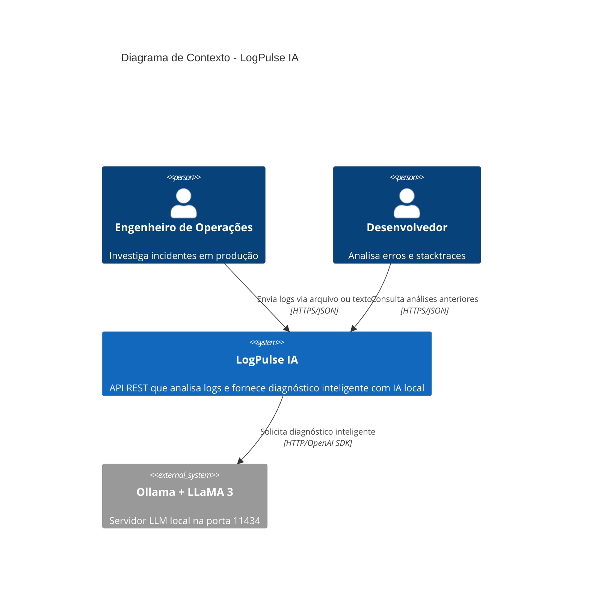
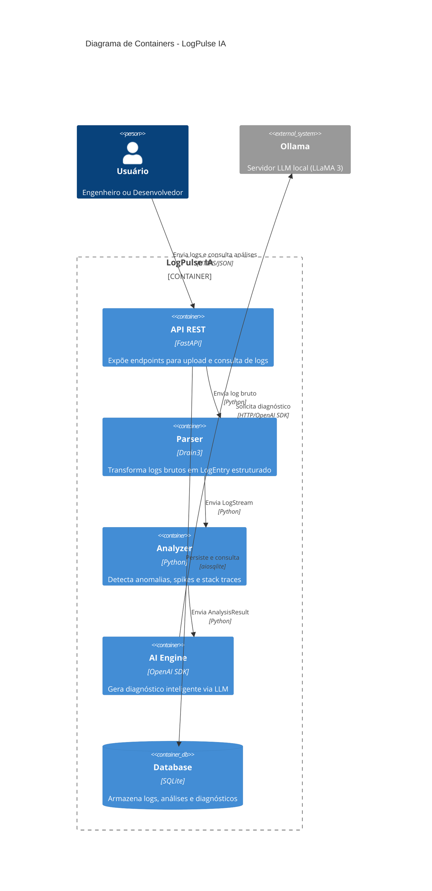
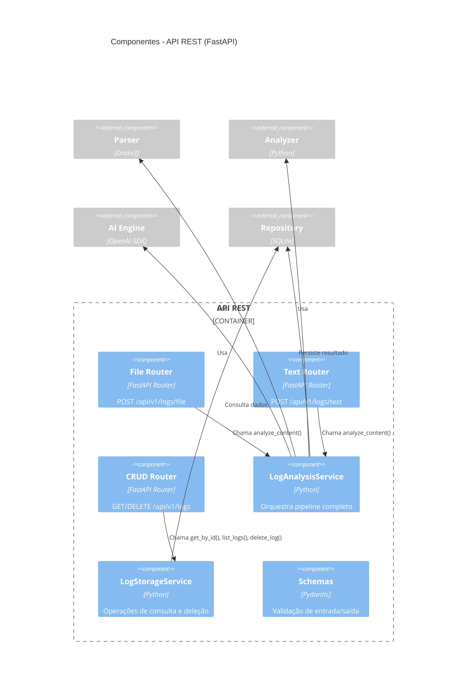
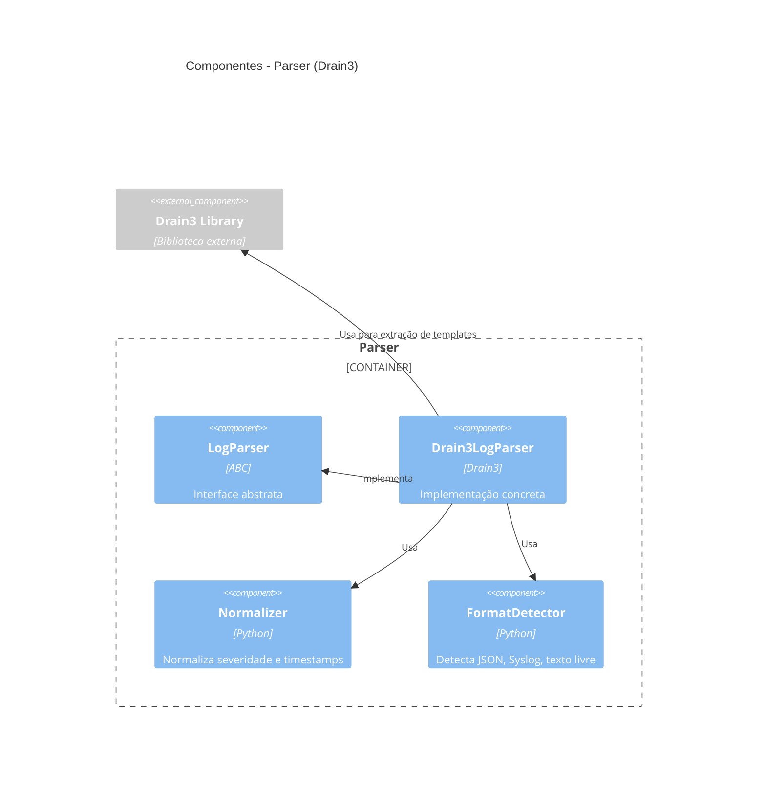
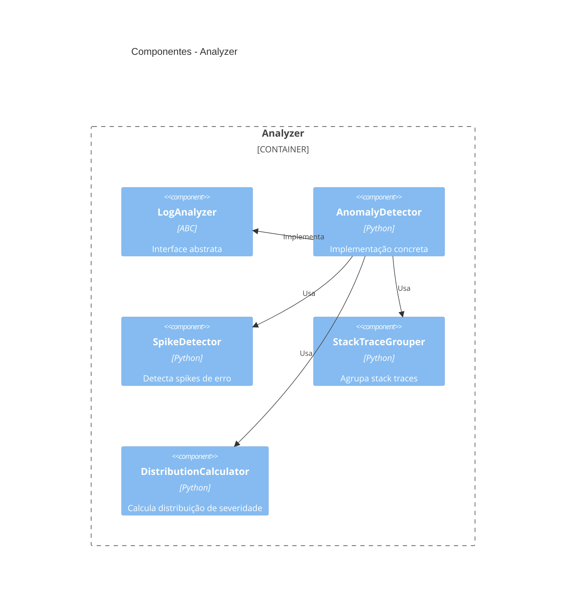
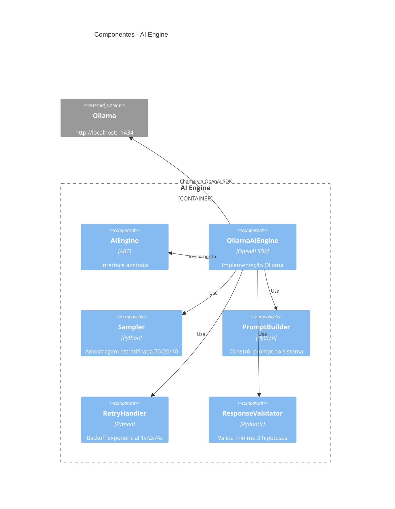
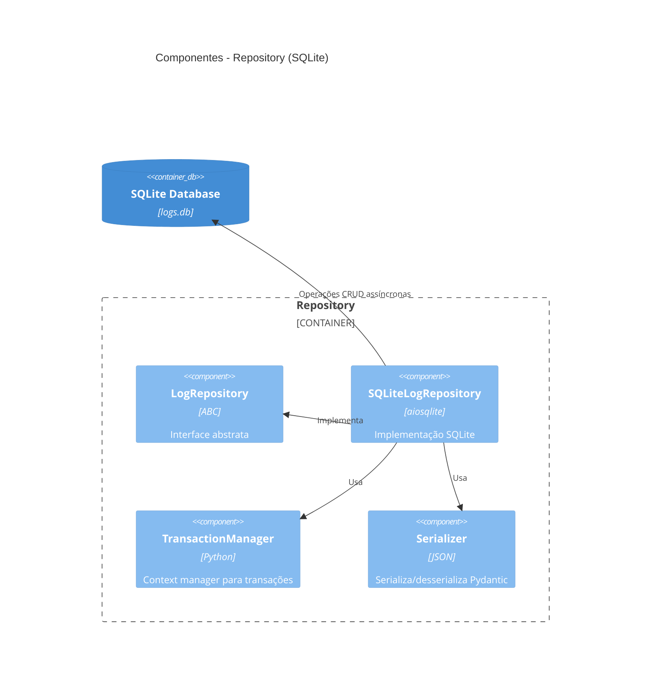
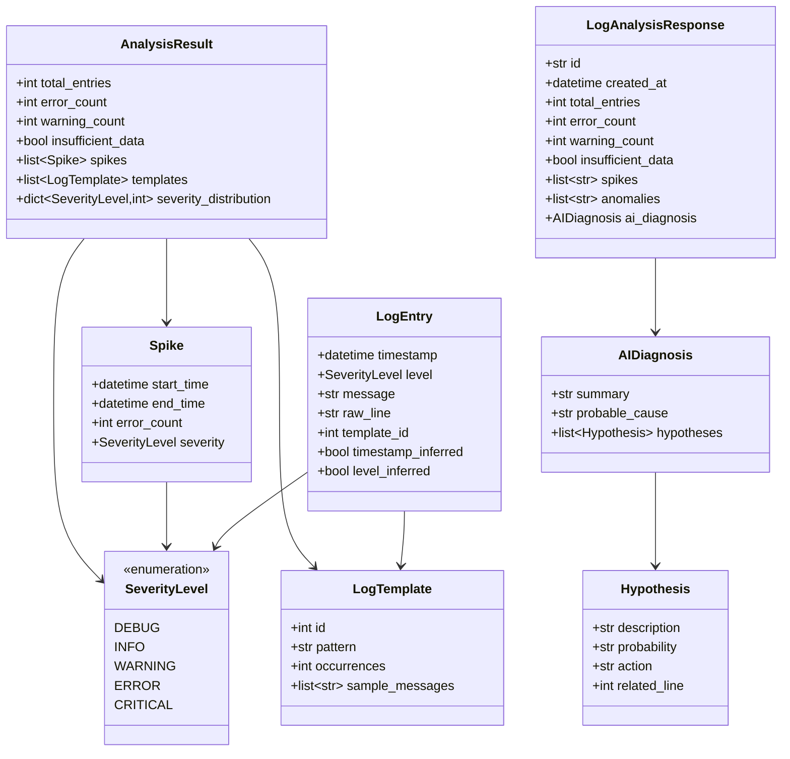
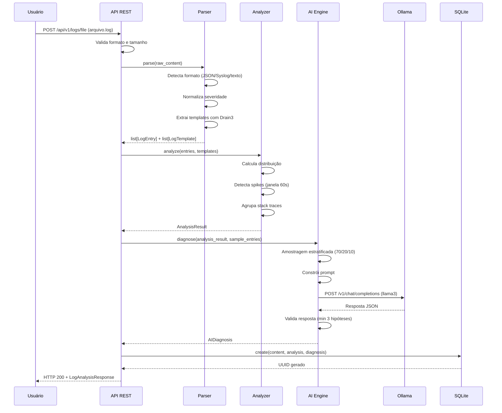
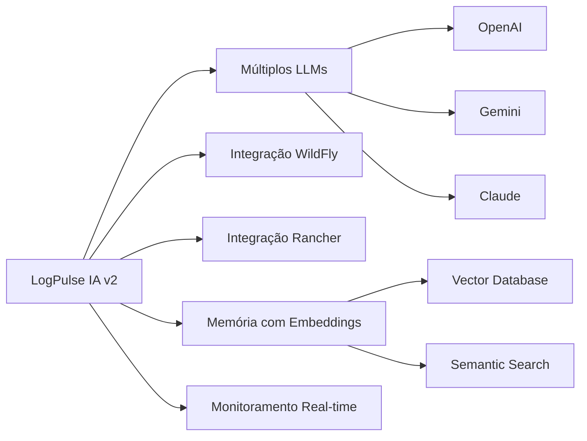

# Diagrama C4 — LogPulse IA

Este documento apresenta a arquitetura do LogPulse IA usando o modelo C4 (Context, Containers, Components, Code).

---

## Nível 1: Diagrama de Contexto

O diagrama de contexto mostra como o LogPulse IA se relaciona com usuários e sistemas externos.

**Descrição:**
- **Usuários:** Engenheiros de operações e desenvolvedores que precisam investigar incidentes rapidamente
- **LogPulse IA:** Sistema central que processa logs e gera diagnósticos
- **Ollama:** Servidor LLM local que fornece capacidades de IA sem dependências externas

---

## Nível 2: Diagrama de Containers

O diagrama de containers mostra os principais componentes técnicos do LogPulse IA.

**Descrição dos Containers:**

| Container | Tecnologia | Responsabilidade |
|-----------|------------|------------------|
| **API REST** | FastAPI + Pydantic | Recebe requisições HTTP, valida payloads, orquestra pipeline |
| **Parser** | Drain3 | Extrai templates, normaliza severidade, infere timestamps |
| **Analyzer** | Python | Detecta spikes, agrupa stack traces, calcula distribuição |
| **AI Engine** | OpenAI SDK | Comunica com Ollama, valida respostas, implementa retry |
| **Database** | SQLite | Persistência assíncrona com aiosqlite |

---

## Nível 3: Diagrama de Componentes

O diagrama de componentes detalha a estrutura interna de cada container.

### 3.1 Container: API REST

**Componentes da API:**

| Componente | Responsabilidade |
|------------|------------------|
| **File Router** | Valida arquivo (.log/.txt), tamanho (50MB), formato |
| **Text Router** | Valida texto (100k chars), aceita \n e \r\n |
| **CRUD Router** | Paginação, validação de UUID, retorno de erros HTTP |
| **LogAnalysisService** | Pipeline: Parser → Analyzer → AIEngine → Repository |
| **LogStorageService** | Consulta por ID, listagem paginada, deleção |
| **Schemas** | LogFileUpload, LogTextUpload, LogAnalysisResponse |

### 3.2 Container: Parser (Drain3)

**Componentes do Parser:**

| Componente | Responsabilidade |
|------------|------------------|
| **LogParser** | Interface abstrata com parse() e get_templates() |
| **Drain3LogParser** | Implementação com depth=4, sim_th=0.4 |
| **Normalizer** | WARN→WARNING, ERR→ERROR, FATAL→CRITICAL, TRACE→DEBUG |
| **FormatDetector** | Detecta JSON, Syslog RFC 3164, texto livre |

### 3.3 Container: Analyzer

**Componentes do Analyzer:**

| Componente | Responsabilidade |
|------------|------------------|
| **LogAnalyzer** | Interface abstrata com analyze() |
| **AnomalyDetector** | Orquestra detecção de anomalias |
| **SpikeDetector** | Janela deslizante de 60s, threshold de 10 erros |
| **StackTraceGrouper** | Detecta Python, Java, Go stack traces |
| **DistributionCalculator** | Contagem por SeverityLevel |

### 3.4 Container: AI Engine

**Componentes do AI Engine:**

| Componente | Responsabilidade |
|------------|------------------|
| **AIEngine** | Interface abstrata com diagnose() |
| **OllamaAIEngine** | Cliente OpenAI SDK apontando para localhost:11434 |
| **Sampler** | 70% erros, 20% warnings, 10% outros (máx 50 entradas) |
| **PromptBuilder** | Cria prompt do sistema para análise de logs |
| **RetryHandler** | 3 tentativas com backoff exponencial, timeout 30s |
| **ResponseValidator** | Valida AIDiagnosis com Pydantic |

### 3.5 Container: Database (Repository)

**Componentes do Repository:**

| Componente | Responsabilidade |
|------------|------------------|
| **LogRepository** | Interface com create(), get_by_id(), list_paginated(), delete() |
| **SQLiteLogRepository** | Implementação assíncrona com aiosqlite |
| **TransactionManager** | Rollback automático em caso de falha |
| **Serializer** | JSON para AnalysisResult e AIDiagnosis |

---

## Nível 4: Diagrama de Código (Modelos de Dados)

O diagrama de código mostra as principais classes e suas relações.

**Relacionamentos:**
- `LogEntry` usa `SeverityLevel` e referencia `LogTemplate` via `template_id`
- `AnalysisResult` agrega `Spike`, `LogTemplate` e distribuição de `SeverityLevel`
- `AIDiagnosis` contém lista de `Hypothesis` (mínimo 3)
- `LogAnalysisResponse` é o schema de saída da API, contendo `AIDiagnosis`

---

## Pipeline de Dados (Fluxo End-to-End)

**Etapas do Pipeline:**
1. **Validação:** API valida formato, tamanho e campos obrigatórios
2. **Parsing:** Drain3 extrai templates e normaliza dados
3. **Análise:** Detector identifica anomalias e calcula métricas
4. **Diagnóstico:** Ollama gera hipóteses de causa raiz via LLM
5. **Persistência:** SQLite armazena log, análise e diagnóstico
6. **Resposta:** API retorna JSON estruturado com UUID

---

## Decisões Arquiteturais

### 1. Arquitetura em Camadas com Inversão de Dependências

**Decisão:** Usar arquitetura em camadas (API → Services → Domain → Infrastructure) com interfaces abstratas (ABC).

**Justificativa:**
- Facilita testes unitários com mocks
- Permite trocar implementações (ex: SQLite → PostgreSQL)
- Separa lógica de negócio de detalhes técnicos

### 2. Drain3 para Extração de Templates

**Decisão:** Usar biblioteca Drain3 em vez de regex manual.

**Justificativa:**
- Algoritmo comprovado para log parsing
- Agrupa mensagens similares automaticamente
- Reduz complexidade de manutenção

### 3. Ollama Local via OpenAI SDK

**Decisão:** Usar Ollama local com OpenAI SDK como drop-in replacement.

**Justificativa:**
- Sem custos de API externa
- Privacidade dos dados (logs não saem do ambiente)
- Compatibilidade com OpenAI SDK facilita migração futura

### 4. SQLite para Persistência

**Decisão:** Usar SQLite em vez de PostgreSQL/MySQL.

**Justificativa:**
- MVP não requer alta concorrência
- Zero configuração (serverless)
- Suficiente para análises históricas

### 5. FastAPI + Pydantic

**Decisão:** Usar FastAPI com validação Pydantic.

**Justificativa:**
- Validação automática de schemas
- Documentação interativa (Swagger)
- Performance superior (async/await)

---

## Requisitos Não Funcionais Mapeados

| Requisito | Componente Responsável | Implementação |
|-----------|------------------------|---------------|
| **RNF-01** (Performance 50MB) | Parser | Leitura linha a linha, sem carregar arquivo inteiro |
| **RNF-02** (Parsing < 1ms) | Drain3LogParser | Algoritmo otimizado do Drain3 |
| **RNF-03** (Resiliência) | Parser | Try-catch por linha, continua processamento |
| **RNF-04** (Segurança) | AI Engine | Envia apenas AnalysisResult + amostras, não log completo |
| **RNF-05** (Qualidade) | Todos | mypy --strict, black, isort, ruff |
| **RNF-06** (Testes 30%) | Todos | pytest + hypothesis |
| **RNF-07** (Python 3.11+) | Todos | Type hints, tomllib stdlib |
| **RNF-08** (Timeout 30s) | AI Engine | RetryHandler com timeout e backoff |
| **RNF-09** (Qualidade IA) | AI Engine | Validação de resposta com Pydantic |

---

## Roadmap de Evolução Arquitetural

### Versão 2 (Fora do MVP)

**Mudanças Arquiteturais Previstas:**
- **Múltiplos LLMs:** Factory pattern para trocar provider
- **Integrações:** Adapters para WildFly, Rancher, Kubernetes
- **Embeddings:** Vector database (Qdrant/Weaviate) para memória semântica
- **Real-time:** WebSocket para streaming de logs
- **Interface Web:** Frontend React/Vue para visualização

---

## Conclusão

O LogPulse IA segue uma arquitetura modular e extensível, com separação clara de responsabilidades:

- **API REST:** Ponto de entrada com validação rigorosa
- **Parser:** Transformação de logs brutos em dados estruturados
- **Analyzer:** Detecção inteligente de anomalias
- **AI Engine:** Diagnóstico com IA local via Ollama
- **Repository:** Persistência assíncrona com SQLite

A arquitetura suporta os requisitos do MVP e permite evolução futura sem grandes refatorações.
